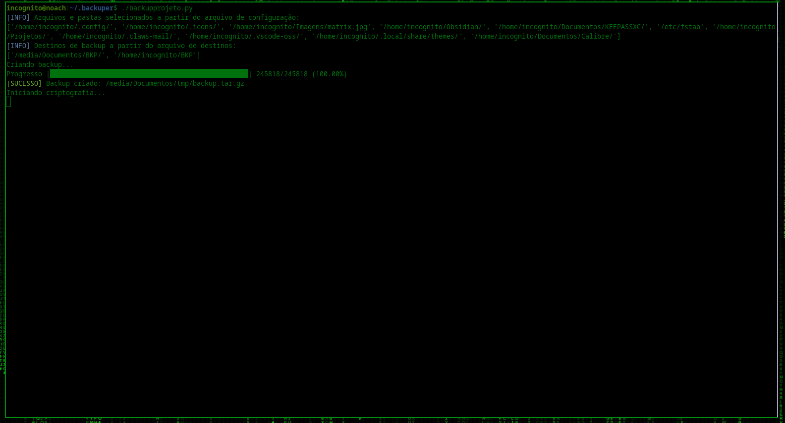
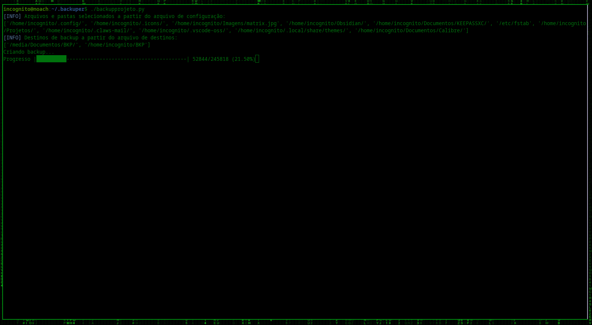
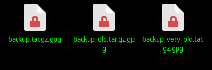

# Backuper - Backup Automático e Criptografado

Este programa realiza o backup de arquivos e pastas especificados, compacta-os, criptografa-os e os armazena em destinos definidos. Ele também gerencia backups antigos mantendo apenas os três backups mais recentes.

## Funcionamento

1. **Criação do Backup**: O programa compacta os arquivos e pastas especificados em um arquivo `.tar.gz`.
2. **Criptografia**: O arquivo compactado é criptografado usando GPG com uma senha fornecida.
3. **Gerenciamento de Backups Antigos**: O programa renomeia backups antigos e mantém somente os três backups mais recentes.

## Arquivos de Configuração

O programa usa três arquivos de configuração:

1. **`backup.conf`**: Lista os arquivos e pastas a serem incluídos no backup.
2. **`destinos.conf`**: Lista os destinos para onde os backups criptografados serão copiados.
3. **`pass.conf`**: Contém a senha usada para criptografar o backup.

   

### Estrutura dos Arquivos de Configuração

- **`backup.conf`**

- **`destinos.conf`**

- **`pass.conf`**

## Instruções de Uso

### 1. Preparação dos Arquivos de Configuração

- Crie um arquivo `backup.conf` e adicione os caminhos dos arquivos e pastas que você deseja incluir no backup.
- Crie um arquivo `destinos.conf` e adicione os caminhos dos diretórios onde o backup criptografado será copiado.
- Crie um arquivo `pass.conf` e adicione a senha que será usada para criptografar o backup.

  

### 2. Executando o Programa

Certifique-se de que os arquivos de configuração estão na mesma pasta que o script. Execute o programa com o seguinte comando:

$ python3 backupprojeto.py

Ou

$ ./backupprojeto.py

Há também um script em Bash que automatiza o backup, é importante alterá-lo ao uso final e sistema de utilização.
